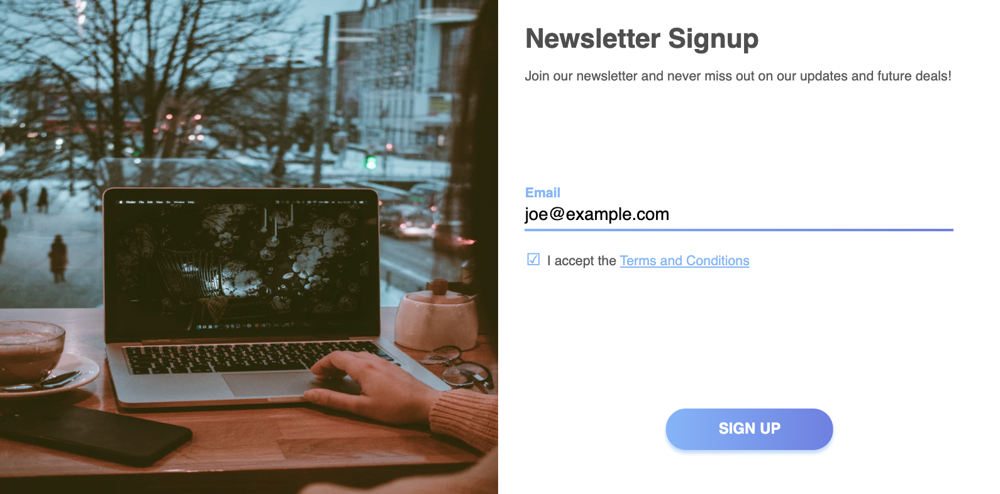
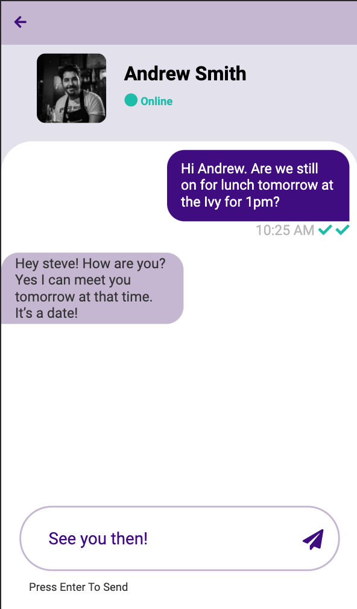
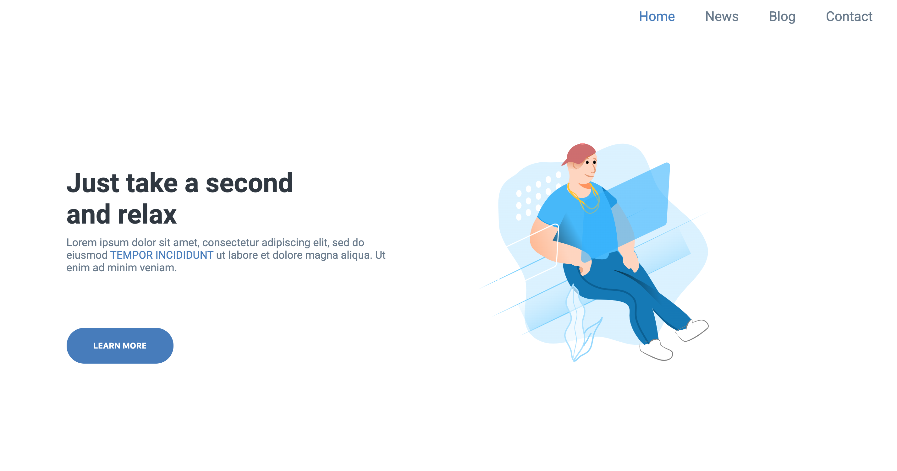
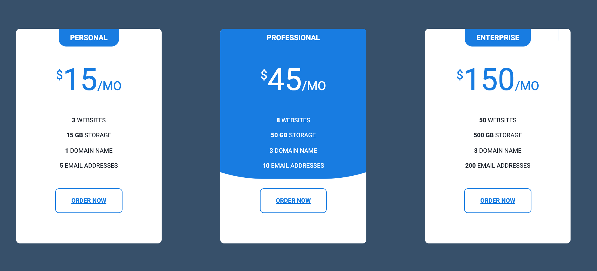

# 7Days7Designs-Challenge

Challenge by DesignCourse: https://www.youtube.com/channel/UCVyRiMvfUNMA1UPlDPzG5Ow

I love creating designs, following design rules, and implementing them in HTML/CSS.
I decided to try and tackle DesignCourses 7days7Designs challenge while stuck indoors during this period.
In his videos he talks about the rules you must follow, usually a required basic layout.
My goal is to try and "keep up" with the challenges each day, finish my work on the day or take just 1 day if I'm behind and do what I can.
I'd also like to design for BOTH mobile and desktop (something that isn't asked).

I plan on using just vanilla HTML/CSS but I may add in some Javascript, React, or SCSS.

All my designs will be created in Figma first. You'll have to trust me that I matched/closely matched those designs! :D

---

## Challenge 1: Newsletter Signup

Desktop screenshot

https://www.youtube.com/watch?v=C9WSSN2f4u0

I wanted to try finish this before the end of day 1 but I only had an hour or so.
I didn't have time to add a success design or add any real javascript here but I'd love to come back and finish it.
I tried to have 2 layouts. For small screen devices, a vertical/column design. for larger devices a row based design.

Mobile screenshot.

---

## Challenge 2: Chat app

https://www.youtube.com/watch?v=dc_gABZzt_U&list=WL&index=27&t=0s

Mobile screenshot.
(Black line on the left is caused by overshooting the screenshot bounds, it's not in the "app")

Intended for mobile. Desktop version was not a consideration for this challenge. I would have went with an iPAD style layout if it was (contacts on a left panel, message content on the right);
I used the ::before element on the Online label to create the circle, which I thought was a clever way to add it.
FontAwesome was used for the icons.

---

## Challenge 3: Landing Page using specific illustration

https://www.youtube.com/watch?v=t-sr6TKdfIM&list=WL&index=26&t=0s

Desktop screenshot

A very simple landing page. I decided to just focus on the "hero" element rather than build out a full landing page.
My goal with this design was not only "simple" but to keep it minimal and modern.
This look could easily be used across various designs as the hero/jumbotron.

---

## Challenge 4: Design whatever you want.

https://www.youtube.com/watch?v=wcGycJagBAE

Desktop screenshot

For this challenge, I was free to design whatever, from a logo to a UI component.
I wanted to keep my rule of not only designing in Figma but to actually create the HTML/CSS for the challenge.
This ruled out doing a logo or something purely just design based.

I decided to go with an animated pricing table. It's mobile friendly thanks to its use of flex.
I could improve this by changing the color of the "professional" card to make it stand out or give each card it's own accent color.
