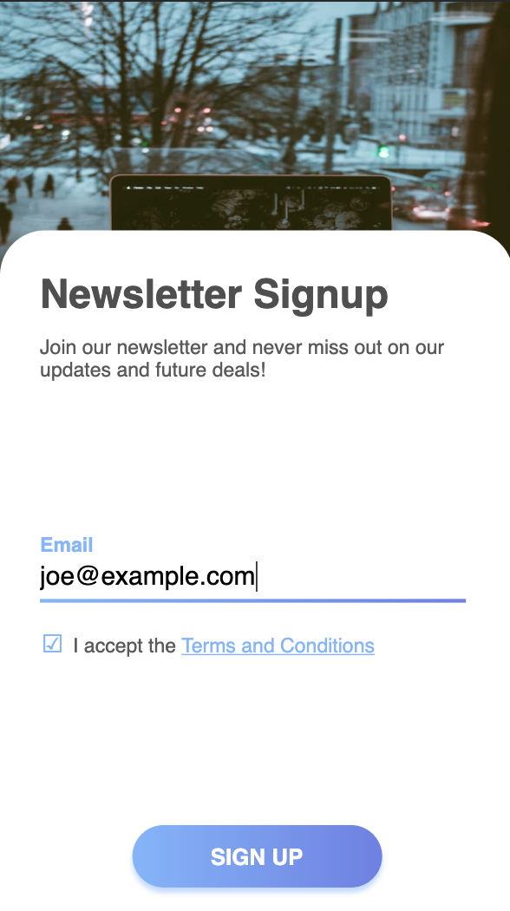

# 7Days7Designs-Challenge

Challenge by DesignCourse: https://www.youtube.com/channel/UCVyRiMvfUNMA1UPlDPzG5Ow
(Whoops, Typo in the Repo name)
(This repo started as just Day 1 but all challenges I try will be added here)

---

Challenge 1: Design a signup form. (Whoops, Typo in the Repo name)
https://www.youtube.com/watch?v=C9WSSN2f4u0

I wanted to try finish this before the end of day 1 but I only had an hour or so.
I didn't have time to add a success design or add any real javascript here but I'd love to come back and finish it.
I tried to have 2 layouts. For small screen devices, a vertical/column design. for larger devices a row based design.

